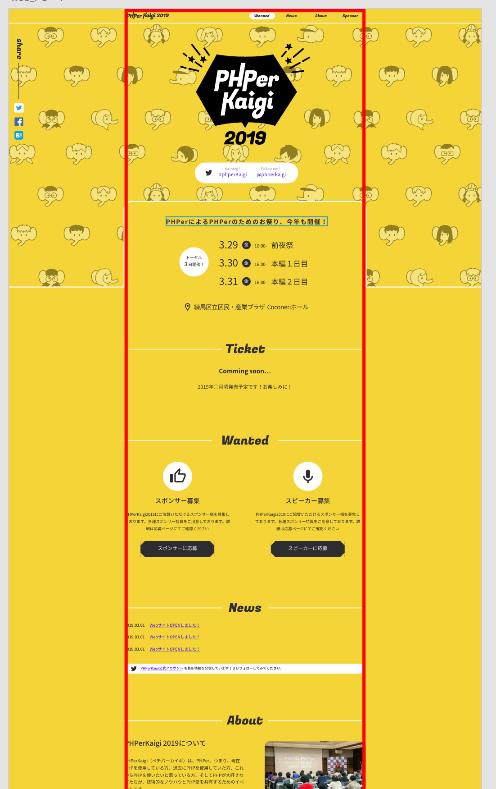

# コンテナとレイアウト

CSS のベースを構築する上で、コンテナとレイアウトの設計は非常に重要です。

コンテナやレイアウトのような要素の配置の設計を適切に行う事により、
変更に強く管理しやすい CSS 構築することができます。

柔軟に変化に対応できる Webデザインを実現するために、
コンテナとレイアウトの設計の基本を学んで行きましょう。

## 基本の CSS の考え方

photoshop などのデザインツールと違って、CSSは積み上げ式のレイアウトです。
上の階層でレイアウトに変化があった場合、下に位置する要素は全て再描画されます。

photoshop などでは一つの要素でデザインに変化を起こしても、
そのオブジェクト内でのみ影響が起こりますが、
CSS ではその周辺に対しても大きな影響が起こります。

--IMAGE HERE--

CSS で変化に強いデザインを表現するには、ブロックの考え方がとても重要です。
各ブロック内で発生する変更が、他のブロックに影響を及ぼさないようにコーディングを進めることで、
変化に強いCSSコーディングを進めることができます。

## コンテナ

コンテナは、Webサイトを構築する上で重要な要素です。
コンテナは、画面の水平レベルでの制御範囲を定義する役割を持ちます。

コンテナは画面内のコンテンツの収まる範囲を設定するブロックで、
コンテンツを一定の範囲内で整列させる役割を持ちます。

### PC 画面でのコンテナ

一般的に PC向けのサイトデザインでは、700 - 1500 px 程度の幅のコンテナを設定します。



PC 画面のコンテナサイズは画面幅よりも小さく設定されることがほとんどです。
コンテナの設定を行わず、画面幅全体に対して要素を配置する場合、例えば 4K などの大きな画面で閲覧した際に、
テキストの折返しがほとんど起こらなくなり、無駄に細長く展開されるテキストのラインがデザイン上の美観を損ねたり、
画面サイズの変化によるテキスト折り返し量の違いでテキスト表現の高さが不安定になる、といった問題があります。

### SP 画面でのコンテナ

SP 画面でのコンテナは、画面のサイズに対して 100% の幅が取られるケースがほとんどです。

SP 画面でのコンテナは、コンテナサイズ = 画面幅跳することで、
画面上の横スクロールを防ぐといった役割があります。

画面 100% でコンテナを設定する都合上、コンテンツ表示領域の幅は柔軟に変化します。
横並びの要素などは、SP の標示範囲内で適切に表示されるよう工夫を施す必要があります。

また コンテナが 画面幅 100% と言っても、画面縁ギリギリまで要素を配置したいケースは少ないでしょう。
画面の左右に適切な余白を設定したい場合、95% 程度のコンテナ幅を設定するか、
コンテナの左右に適切な パディングを設けて非表示領域を設定しましょう。

### コンテナとコーディング

コンテナをCSS で表現する場合、以下のようなコードになります。

```css
.container{
    width: 100%;
    max-width: 784px;
    margin-right: auto;
    margin-left: auto;
}
```

これを使ってHTMLを記述する場合、以下のような形になるでしょう。

```html
<div class="container">
    <section class="header"> ... </section>
    <section class="hero"> ... </section>
    <section class="about"> ... </section>
    <section class="service-list"> ... </section>
    <section class="contact"> ... </section>
    <section class="footer"> ... </section>
</div>
```

全ての要素をコンテナ要素の内部に配置するコーディングはシンプルでわかりやすい反面、
コンテナの外部に何も装飾を施せないという欠点があります。

通常、コンテナの外部にはコンテンツを配置しませんが、
背景色や罫線などはコンテナを突き抜けて、画面全体に展開したいケースもあるでしょう。

```html
<section class="header">
    <div class="container"> ... </div>
</section>
<section class="hero">
    <div class="container"> ... </div>
</section>
<section class="about">
    <div class="container"> ... </div>
</section>
<section class="service-list">
    <div class="container"> ... </div>
</section>
<section class="contact">
    <div class="container"> ... </div>
</section>
<section class="footer">
    <div class="container"> ... </div>
</section>
```

上記のようにそれぞれのセクションごとが内部にコンテナを含むようにすれば、
コンテナ外への装飾も簡単に適用することができるようになります。

## HTML タグの使い方

CSS コーディングだけでなく、適切なHTMLタグを利用することは、
可読性の高いコーディングを行う上で必要不可欠です。

div や span などの汎用的なタグは便利な一方、要素の意味合いを見えにくくします。
HTMLには 要素の意味合いに応じて様々なタグが利用可能なため、
これを利用することで、HTML の読みやすさを向上させたり、CSS実装の手間を省けたりします。

### セクショニングコンテンツ 

通常サイト内のコンテンツは、一枚岩でできているのではなく、
複数の意味上のまとまりから構成されています。

サイト内で何らかの意味を持った独立した塊(ｶﾀﾏﾘ)を、
セクショニング・コンテンツといって、
`div` ではでなくセクショニング・コンテンツ用のタグを用いてコーディングされることが推奨されています。

- `section` ページのコンテンツ内で アウトライン上の単位(章・節・項)として成立するまとまり
- `article` ページのコンテンツ内で、独立完結した一つのドキュメントとして捉えられるまとまり
- `aside` ページの主要な要素に対して、補足的なコンテンツとしてのまとまり
- `nav` ページのコンテンツ内で、他のページに対する誘導を行うためのまとまり

セクショニングコンテンツは、それ自体が意味あいを持ったまとまりであるため、
そこには何らかの名前がつけられるはずです。
そのため、セクショニングコンテンツの内部では h1-6 系の見出しタグを利用した見出しの定義が推奨されています。

セクショニングコンテンツの内部には新しいセクショニングコンテンツを記述することも可能です。

```html
<section>
    <h2>私達にできること</h2>
    <p>私達は Web制作事業を通じて、様々なお客様の ... </p>
    <section>
        <h3>メディアサイト制作</h3>
        <p>メディアサイト制作の豊富な事例と実績を基に ...</p>
    </section>
    <section>
        <h3>官公庁向けサイト制作</h3>
        <p>メディアサイト制作の豊富な事例と実績を基に ...</p>
    </section>
</section>
```

セクショニングコンテンツがページ内での意味上の表すのに対し、
`header` や `footer` は、ページ全体または特定のセクション内でのレイアウト上での意味付け（ヘッダー・フッター）を表します。

このため、`header` や `footer` `main`　内への見出し要素の配置は完全に任意となっています。

### その他のHTML要素

クリックされることが期待される要素には、`a` や `button` の要素を用いるのが適切です。
装飾ボタンやクリック領域を `div` や `span` で実装した場合、
JavaScript 上で click イベントが発生しないという問題が iOS Safari で発生します。

この問題は CSS 側で `cursor: pointer` のプロパティを定義することで解決可能ですが、
わざわざCSSで特殊なハックを実装するよりも 適切なHTMLを利用してコーディングを行うほうが理解しやすいでしょう。

リストの要素は `ul` `ol` `dl` などの要素を用いて記述することもできます。
例えばHTMLをPHPのシステムやjQuery/Vue.js などのJSコードへ組み込んで利用する場合、
繰り返しの記述は プログラムの構文を用いて書き換える事があります。
`ul` `ol` `dl` など のリスト要素を用いてコーディングされている場合、
`li` や `dt` `dd` などの要素で繰り返し部分がすぐに判別できるため組み込み時の可読性が非常に高まります。

## 仕様変更と改修

サイトの仕様が変更されるとサイトの見た目は変更されます。
見た目の変更には HTMLとCSSの修正が必要となりますが、
この修正がなるべく簡単に済むようにコーディングを進めたいものです。

一口に「修正」と言ってもそこには様々な修正があります。

- 文言や画像など既存のコンテンツの差し替え
- コンテンツの重要度や意味合いの変化によるレイアウトの変化・並び替え
- デザイン、レイアウトの趣向の変化

様々な修正に対してどのようにサイトを強くするかを考えてみましょう。

### コンテンツの差し替えに対する柔軟性

コンテンツの差し替えは、運用上必ず発生しうるものです。

前提として差し替えうる項目と固定の項目を確認しておくのはディレクション上とても重要です。
差し替えうる項目に関しては、コーディング上である程度の柔軟性を担保する必要があります。

画像のコーディングについては、必ず 幅 か 高さのいずれかを設定するようにしましょう。
幅も高さも設定しない場合、差し替え画像の解像度の変化で画像の表示領域が変化してしまいます。
逆に画像の幅と高さ両方を指定する場合、箚し買えば前後で画像の縦横比が違う場合、画像に歪みが発生してしまいます。

幅か高さで迷った場合、幅を固定に設定するのが良いでしょう。
横の長さが無限に大きくなる場合、コンテナから表示領域が溢れたりして、意図しない横スクロールが発生してしまうなどの問題があります。

文字に関しても文章の溢れを考慮しておくと良いでしょう。
特に表示領域幅の狭いエリアでは、文章量増加に対する行数の増え具合が大きくなります。

また word-break の設定にも注意が必要です。
URLなどのように、一単語で認識されうる長い英数字が表示される場合、
適切な word-break の設定がないと表示幅があふれる可能性もあります。

https://developer.mozilla.org/ja/docs/Web/CSS/word-break

### コンテンツの重要度の変化に強くする

運用上でコンテンツの重要度や意味合いが変化するケースもあります。

お問い合わせを強化するために、お問い合わせセクションを一番上に持ってきたり、
お知らせの表示件数を 3件から 5件に強化したり。

運用上で生じるアウトライン上の変化に関しても柔軟に対応できるためには、
セクショニングコンテンツを用いた意味上のグループわけが不可欠です。

コンテンツの重要度の変更があった場合でも、意味上のまとまりが分割されるケースは稀で、
レイアウトの変更は、意味上のまとまり・セクショニングコンテンツの単位で行われるケースがほとんどです。

セクショニングコンテンツが、コンテナに対して 幅 100%のブロックレベル要素で定義されているのであれば、
レイアウト上の並び替えはコーディング作業上大きな問題となることは少ないでしょう。

逆に、水平方向に意味合いの異なる項目が並んでいる場合、
一つのコンテンツを変更した影響が、他の並ぶコンテンツにまで及んでしまうケースがあるかもしれません。
画面の表示領域を有効活用するために、特にファーストビューなどで意味合いの異なるコンテンツが横に並ぶケースは多々あるかもしれませんが、
変更に強いデザインを構築する上で、そのようなデザイン構成はなるベく避けるほうが良いでしょう。

### デザイン認識すり合わせ不足によるデザイン改善の変化

デザインの趣向の変化は、サイトデザインに関する認識のすり合わせ不足から生じるもので、
これの対応は場合によってはとても困難になります。

根本的に デザインの刷り直しが発生するケースで CSS の保守性を考えるのは無意味です。
コーディング上の工夫で デザインの刷り直しに対する対応力を上げることは不可能なので
デザインテイストの確認は、ディレクションの段階でしっかりと行っておく必要があります。

## レイアウトコーディングのテクニック

最後に、レイアウト関連のコーディングを行う際に必須となるコーディング上の概念をいくつか紹介していきます。

CodePen などのツールを用いながら実際に コーディングの流れを確認しておきましょう。

### ブロック要素とインライン要素

HTML 上の要素は、大きく ブロック要素とインライン要素に分かれます。

ブロック要素は、div や section などの HTML で記述される要素で、
通常フローに置いて、要素の前後に改行を生成します(他の要素と横に並ばない)。

インライン要素は、a や span などのHTMLで記述される要素で、
通常フローに置いて、要素の前後に改行を生成せず、インライン要素同士は横並びで表示されます。

CSS 要素の中には、 ブロック要素でしか適用されないものが存在するため、
ブロック・インラインの種別には注意が必要です。

例えば `height` `width` `margin` `padding` など [CSS基本ボックスモデル](https://developer.mozilla.org/ja/docs/Web/CSS/CSS_Box_Model)
を定義するプロパティは ブロック要素でのみ有効なプロパティとなります。

HTMLの各要素は、要素ごとに標準のブロック・インラインの区別を持っていますが、
CSS プロパティの `display` を用いてこれを変更することも可能です。

https://developer.mozilla.org/ja/docs/Web/CSS/display-outside

### 横に並べるコーディング

要素を横に並べる方法は、様々なものがあります。

`position:absolute` や `float` を使った方法は古くから存在する手法ですが、
レイアウトの概念が親要素から独立するため、とても取り扱いが悪く、多用することはおすすめしません。

単純に横並べを実現する場合 `display:inline-block` を用いる方法が簡単です。

```html
<div class="list-item">apple</div>
<div class="list-item">lemon</div>
<div class="list-item">banana</div>

<style>
.list-item{
    display: inline-block;
}    
</style>
```

`display:inline-block` は簡単に横並びを実現できますが、
要素間に微妙なスペースが空いてしまうという問題があります。

要素間のスペースを厳密に処理したい場合は、 `display:table-cell` を用いることもできます。

 
```html
<div class="list-group">
    <div class="list-item">apple</div>
    <div class="list-item">lemon</div>
    <div class="list-item">banana</div>
</div>
 
<style>
.list-group{
    display: table;
    border-spacing: 2px 0;
    border-collapse: separate;
}
.list-item{
    display: table-cell;
}    
</style>
```

`border-spacing` は要素の両端にスペースを設けることが可能ですが、
両端のアイテムにもスペースが適用されてしまうという問題があります。

もし両端にはスペースを適用せず、要素と要素の間にのみスペースを適用したいという場合には、
次に紹介する Flexbox を利用すると良いでしょう。

### Flexbox

flexbox は柔軟にレイアウトを組むことが可能な新しいCSS プロパティです。

```html
<div class="list-group">
    <div class="list-item">apple</div>
    <div class="list-item">lemon</div>
    <div class="list-item">banana</div>
</div>
 
<style>
.list-group{
    display: flex;
    justify-content: space-between;
}
</style>
```

親要素に `display:flex` を適用することで、簡単に内部の要素を横並びにすることができます。

`display:flex` とセットで使用する プロパティ `justify-content` は横軸での要素の並びを調整できるプロパティで、
`space-between`のように設定することで、両端を除く要素同士の隙間にのみスペースを適用することが可能になります。

https://developer.mozilla.org/ja/docs/Web/CSS/CSS_Flexible_Box_Layout/Using_CSS_flexible_boxes


### ブロック要素の垂直・水平中央揃え

ブロック要素を親要素に対して水平中央揃えする場合は、
左右のマージンを auto で設定します。

```
.box{
  width: 200px;
  margin-right: auto;
  margin-left: auto;
}
```

想像に反して、`margin-top` `margin-bottom` の 値を `auto` で設定しても、
垂直方向で中央に配置されることはありません。

水平方向の中央揃えを行いたい場合には `flexbox` の `align-items: center` を用いると良いでしょう。

https://developer.mozilla.org/ja/docs/Web/CSS/align-items

### インライン要素の配置調整
 


### ブロックとマージンの管理

マージンの相殺は大きな問題です。

上下に並ぶコンテンツのうち、上の要素の margin-bottom と 下の要素の margin-top はお互いに相殺され、
大きい方値のみがマージンとして適用されます。

<p data-height="265" data-theme-id="0" data-slug-hash="gZpZJQ" data-default-tab="css,result" data-user="mikakane" data-pen-title="gZpZJQ" class="codepen">See the Pen <a href="https://codepen.io/mikakane/pen/gZpZJQ/">gZpZJQ</a> by mikakane (<a href="https://codepen.io/mikakane">@mikakane</a>) on <a href="https://codepen.io">CodePen</a>.</p>
<script async src="https://static.codepen.io/assets/embed/ei.js"></script>

また、親要素内の小要素に設定されたマージンのうち、  
一番最初の小要素の margin-top は、親要素の margin-top として認識され  
一番最後の子要素の margin-bottom は 親要素の margin-bottom として認識されます。
親要素がすでに `margin-top` `margin-bottom` を持っている場合、
大きい方の値が `margin` として適用されます。

この親子間でのマージンの相殺は、 以下のようなケースでは生じないため、更に注意が必要です。

- 親要素が border を設定している場合
- 親要素が padding を設定している場合
- 親要素がインラインコンテンツをもつ場合
- 親要素に `overflow: hidden` が設定されている場合

https://developer.mozilla.org/ja/docs/Web/CSS/CSS_Box_Model/Mastering_margin_collapsing

マージンの仕様として相殺を理解するのはもちろん大事ですが、
全体でマージンの付け方のポリシーを設定するのも重要です。

上下でマージンを設定する場合相殺が起こるので、要素感の垂直方向のマージンは、
`margin-bottom` で設定するか、`margin-top` で設定するかを統一しておくのが良いでしょう。

通常サイトの開始いちでマージンが生じるケースは少ないので、
特に問題がない限り `margin-bottom` で統一するのがおすすめです。

